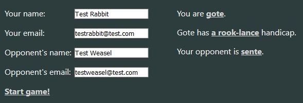
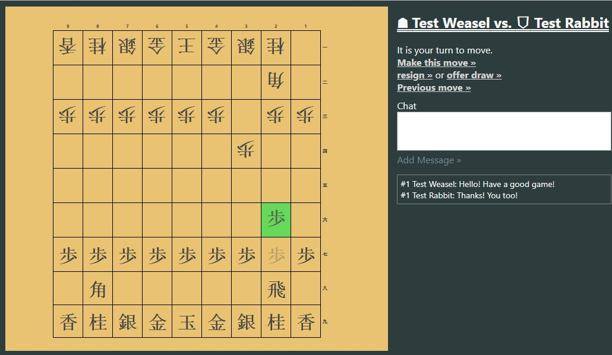

# Shogi Server

Deployed [here](https://shogiserver.herokuapp.com).

This app aims to provide the same asynchronous play functionality for shogi (Japanese chess) as [Dave Peck's Go](http://go.davepeck.org/) does for go. It is built in React backed by an Express server and a MongoDB (MERN stack).

## How it works

The app allows users to create a shogi game with an opponent using their email address. It allows for handicap play up to a 10-piece handicap. In game, the user may select and execute a move, resign the game, offer a draw, or leave a chat message for their opponent. On the backend, games are stored in a MongoDB and identified with three unique ObjectID's - one for the game, and one for each of the players to use as an access key. Most of the game logic is handled on the front end, with the DB holding only the initial conditions of the game (handicap, which player plays which side) and a move list.

The game creation page looks like this:

The game page looks like this:

Active options are shown in white. Legal moves are highlighted green when the player clicks on the origin square, and the move the player has selected is ghosted in a more transparent shade before the player selects "Make this move."

## To get it running

The easiest way to get a local client up and running is to clone the repo and run `yarn install`. It is also possible to use NPM as the primary package manager, but you must be sure to delete the `yarn.lock` file in the primary directory, or confusion will result. Once you have removed the `yarn.lock` file, run `npm install` and a new `package-lock.json` will be created in its place.

You must also have a local instance of MongoDB running to use the app locally. Directions for setting up your local instance can be found [here](https://docs.mongodb.com/manual/mongo/).

## Built With
* [React](https://reactjs.org/)
* [Mongoose](https://mongoosejs.com/)

## Authors
* **Colin Grant** - sole author
